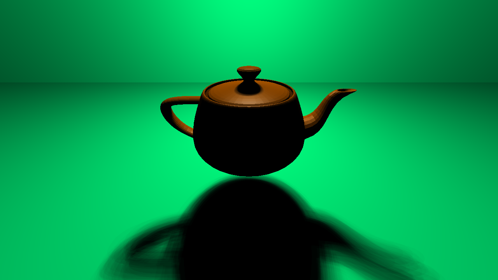
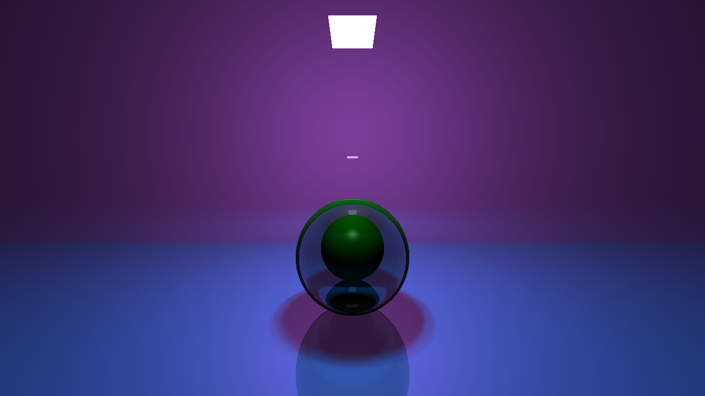
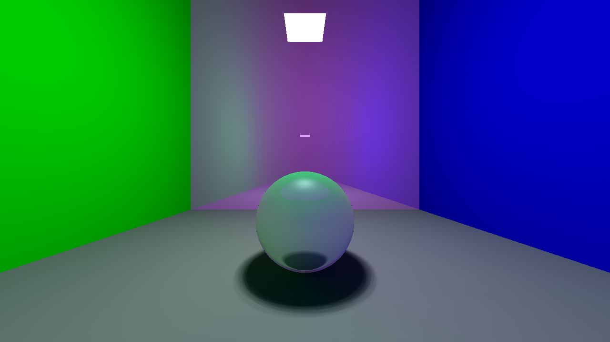

# raytracing
A ray-tracing project

# Environment

Linux & c++14

Use `cd bin && make` to build target `main`.

Run `./main` to generate the picture, the result would be put in file `output.ppm`.

# Rendered Function (效果)

## Soft Shadow 【软阴影】

Please `git checkout soft-shadow` then make.

The rendered picture is

You can see that the shadow of the teapot is a soft one.【茶壶的阴影是软阴影】

The teapot is composed of `2644` vertices and `6320` triangles, which is loaded from file `models/teapot.obj`.【茶壶由`2644`个点和`6320`个三角面片组成，模型文件为`models/teapot.obj`】

## Refraction 【透射】

Please `git checkout soft-shadow` then make.

The rendered picture is

There are two balls in the scene, one of solid green material, one of transparent substance with index `1.1`.【场景中有两个绿色的球，远的是绿色实心球，近的是折射率为`1.1`的透明球】

## Color Bleeding

Please `git checkout soft-shadow` then make.

The rendered picture is

The left and right sides of the floor are of slightly different color. The left side contains more green color and the right side has more blue color.【地板的左右两侧的颜色略有不同，左侧偏绿，右侧偏蓝】

